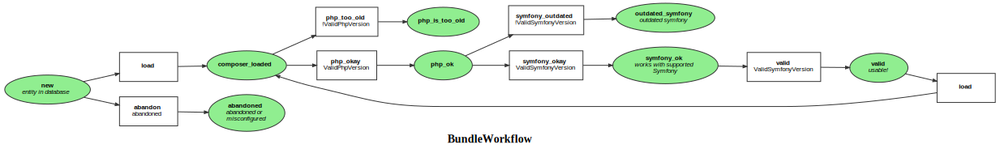

Markdown for BundleWorkflow




## load -- transition


```php
#[AsTransitionListener(self::WORKFLOW_NAME, self::TRANSITION_LOAD)]
public function onLoadComposer(TransitionEvent $event): void
{
    $package = $this->getPackage($event);
    // @todo: check updatedAt
    if (true || !$data = $package->getData()) {
        $this->loadLatestVersionData($package);
    }
    $this->packageService->populateFromComposerData($package);
}
```
blob/main/src/Workflow/BundleWorkflow.php#L143-151
        


## load -- completed


```php
#[AsCompletedListener(self::WORKFLOW_NAME, self::TRANSITION_LOAD)]
public function onLoadCompleted(CompletedEvent $event): void
{
    $package = $this->getPackage($event);
    foreach ([self::TRANSITION_PHP_TOO_OLD, self::TRANSITION_PHP_OKAY] as $transitionName) {
        if ($this->workflow->can($package, $transitionName)) {
            $this->workflow->apply($package, $transitionName);
        }
    }
}
```
blob/main/src/Workflow/BundleWorkflow.php#L121-129
        

## php_okay -- completed


```php
#[AsCompletedListener(self::WORKFLOW_NAME, self::TRANSITION_PHP_OKAY)]
public function onPhpOkayCompleted(CompletedEvent $event): void
{
    $package = $this->getPackage($event);
    foreach ([self::TRANSITION_OUTDATED, self::TRANSITION_SYMFONY_OKAY] as $transitionName) {
        if ($this->workflow->can($package, $transitionName)) {
            $this->workflow->apply($package, $transitionName);
        }
    }
}
```
blob/main/src/Workflow/BundleWorkflow.php#L132-140
        
