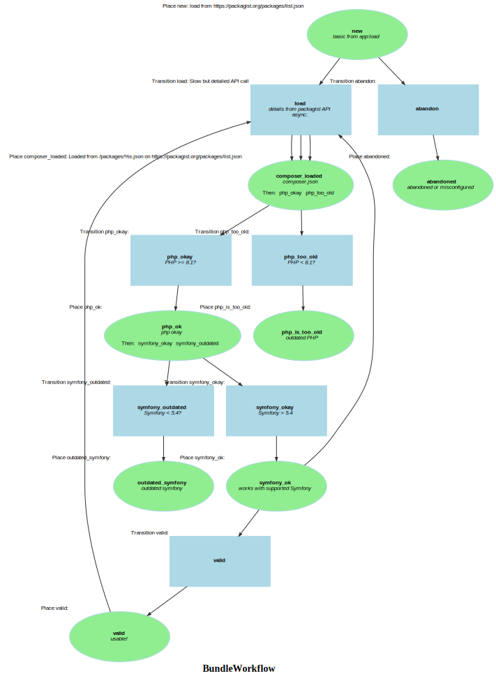

Markdown for BundleWorkflow




---
## Transition: load

### load.Transition

onLoadComposer()
        // 
        // 

```php
#[AsTransitionListener(self::WORKFLOW_NAME, self::TRANSITION_LOAD)]
public function onLoadComposer(TransitionEvent $event): void
{
    $package = $this->getPackage($event);
    // @todo: check updatedAt
    if (true || !$data = $package->data) {
        $this->loadLatestVersionData($package);
    }
    $this->packageService->populateFromComposerData($package);
}
```
[View source](packages/blob/main/src/Workflow/BundleWorkflow.php#L142-L150)

### load.Completed

onLoadCompleted()
        // 
        // 

```php
#[AsCompletedListener(self::WORKFLOW_NAME, self::TRANSITION_LOAD)]
public function onLoadCompleted(CompletedEvent $event): void
{
    $package = $this->getPackage($event);
    foreach ([self::TRANSITION_PHP_TOO_OLD, self::TRANSITION_PHP_OKAY] as $transitionName) {
        if ($this->workflow->can($package, $transitionName)) {
            $this->workflow->apply($package, $transitionName);
        }
    }
}
```
[View source](packages/blob/main/src/Workflow/BundleWorkflow.php#L120-L128)


---
## Transition: php_okay

### php_okay.Completed

onPhpOkayCompleted()
        // PHP &gt;= 8.1?
        // 

```php
#[AsCompletedListener(self::WORKFLOW_NAME, self::TRANSITION_PHP_OKAY)]
public function onPhpOkayCompleted(CompletedEvent $event): void
{
    $package = $this->getPackage($event);
    foreach ([self::TRANSITION_OUTDATED, self::TRANSITION_SYMFONY_OKAY] as $transitionName) {
        if ($this->workflow->can($package, $transitionName)) {
            $this->workflow->apply($package, $transitionName);
        }
    }
}
```
[View source](packages/blob/main/src/Workflow/BundleWorkflow.php#L131-L139)


