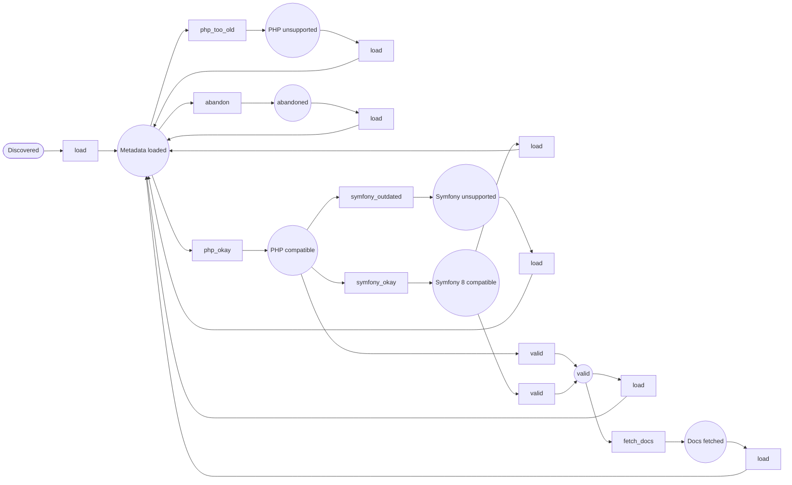

Workflow: BundleWorkflow
========================

*Generated by `doc:workflows` on `2026-10-08T12:37:48+00:00`. Type: workflow.*

Diagram
-------



[High-resolution SVG](BundleWorkflow.svg)

Places
------

* `new` *(initial)* — load from https://packagist.org/packages/list.json
* `composer_loaded` — Loaded from /packages/%s.json on https://packagist.org/packages/list.json
* `outdated_symfony` — Does not support Symfony 8
* `symfony_ok` — Supports Symfony 8
* `php_is_too_old` — outdated PHP
* `php_ok` — php okay
* `abandoned` — abandoned or misconfigured
* `valid` — usable!
* `documented` — README / AGENTS.md fetch attempted; either may be null

Transitions
-----------

|Transition|From|To|
|:-|:-|:-|
|`load`|`new`|`composer_loaded`|
|`load`|`symfony_ok`|`composer_loaded`|
|`load`|`outdated_symfony`|`composer_loaded`|
|`load`|`php_is_too_old`|`composer_loaded`|
|`load`|`abandoned`|`composer_loaded`|
|`load`|`valid`|`composer_loaded`|
|`load`|`documented`|`composer_loaded`|
|`abandon`|`composer_loaded`|`abandoned`|
|`valid`|`php_ok`|`valid`|
|`valid`|`symfony_ok`|`valid`|
|`php_too_old`|`composer_loaded`|`php_is_too_old`|
|`php_okay`|`composer_loaded`|`php_ok`|
|`symfony_outdated`|`php_ok`|`outdated_symfony`|
|`symfony_okay`|`php_ok`|`symfony_ok`|
|`fetch_docs`|`valid`|`documented`|

Listeners
---------

*App listeners subscribed to this workflow's events, with source.*

### `App\Workflow\BundleWorkflow::onFetchDocs()`

Events: `workflow.BundleWorkflow.transition.fetch_docs`

`src/Workflow/BundleWorkflow.php` (L151–L154)

```php
public function onFetchDocs(TransitionEvent $event): void
{
    $this->docsFetcher->fetch($this->getPackage($event));
}
```

### `App\Workflow\BundleWorkflow::onLoadComposer()`

Events: `workflow.BundleWorkflow.transition.load`

`src/Workflow/BundleWorkflow.php` (L157–L165)

```php
public function onLoadComposer(TransitionEvent $event): void
{
    $package = $this->getPackage($event);
    // `load` always loads: whether a package needs reloading is decided before the
    // transition is dispatched (https://packagist.org/apidoc#track-package-updates),
    // not here. Repeat fetches are absorbed by the caching packagist.client.
    $this->loadLatestVersionData($package);
    $this->packageService->populateFromComposerData($package);
}
```

### `App\Workflow\BundleWorkflow::onValidCompleted()`

Events: `workflow.BundleWorkflow.completed.valid`

`src/Workflow/BundleWorkflow.php` (L145–L148)

```php
public function onValidCompleted(CompletedEvent $event): void
{
    $this->requiredPackageDiscovery->discover($this->getPackage($event));
}
```